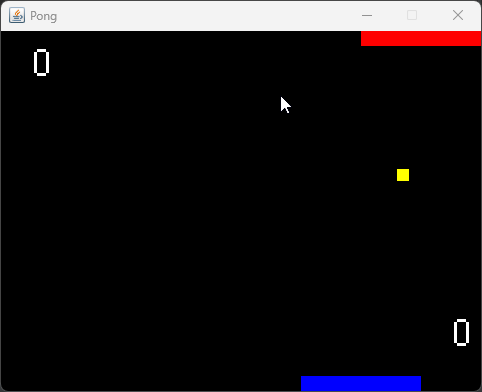

# kotlin-pong
Mini game of Pong using Kotlin and native Java components

## Run
Just execute main method on [Game](./src/main/kotlin/com/jrobertoss/pong/Game.kt) object

## Gameplay instructions
* Control player (bottom bar) with ← and → 
* Prevent the ball from crossing the bottom boundaries
* Try to score by making the ball cross the upper boundaries

## Preview

